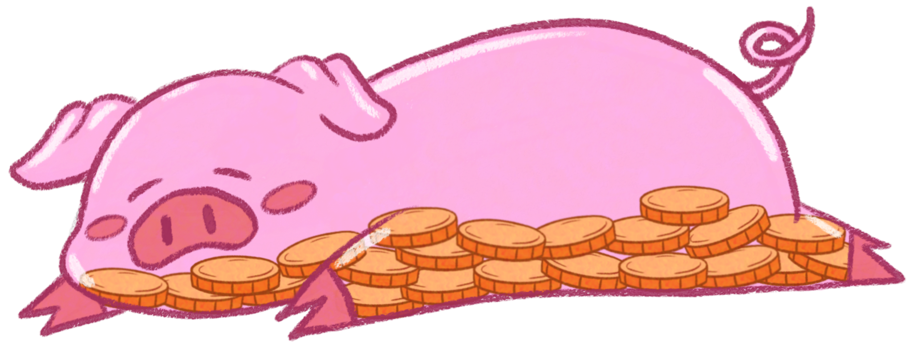

# 🐖 **Coink**

**Coink** es una aplicación pensada para ayudar a gestionar el dinero de forma divertida y visualmente atractiva, permitiendo establecer un límite de gasto mensual y hacer un seguimiento visual de tus gastos con un cerdito ahorrador que se va poniendo triste conforme te acercas a tu presupuesto máximo.

## 📘 **Acerca de este proyecto**

Este proyecto fue iniciado en verano, justo después de terminar el curso de DAM1 (Desarrollo de Aplicaciones Multiplataforma), como una forma de practicar programación y mejorar mis habilidades. Es un proyecto en el que comencé a aprender un nuevo lenguaje de programación desde cero (Kotlin). A pesar de que la aplicación tiene algunas funcionalidades, sé que hay algo de descontrol en algunos aspectos del código, pero la idea es seguir aprendiendo y mejorando mientras desarrollo la app.

## 🔧 **Funcionalidades en progreso**

- **Pantalla Principal**: La pantalla principal muestra los gastos añadidos en unos bocadillos que van desapareciendo conforme más antiguos son. Además, el cerdito va perdiendo monedas y poniéndose triste a medida que te acercas al presupuesto máximo.
- **Añadir Gastos**: En esta pantalla se pueden añadir los gastos, eligiendo entre varias categorías y especificando si ese gasto se restará o sumará al gasto máximo. También se puede añadir el nombre, monto y una anotación si se desea.
- **Historial de Gastos**: Esta pantalla muestra todos los gastos realizados, y al pulsar sobre uno, se abre una ventana con los detalles de ese gasto, como fecha, categoría, nombre y notas.
- **Ajustes**:
  - **Modificar Gasto Máximo**: Cambiar el límite máximo de gasto mensual.
  - **Cambio de Idioma**: En un principio solo estará disponible el inglés.
  - **Modo Claro y Oscuro**: Cambiar el tema de la aplicación.

## ⚙️ **Estado del proyecto**

Actualmente, la aplicación está en fase de desarrollo, con algunas funcionalidades ya implementadas y otras en progreso.

#ACTUALIZACIÓN: debido al empiece del nuevo curso, la aplicación está en pausa.
   

  

